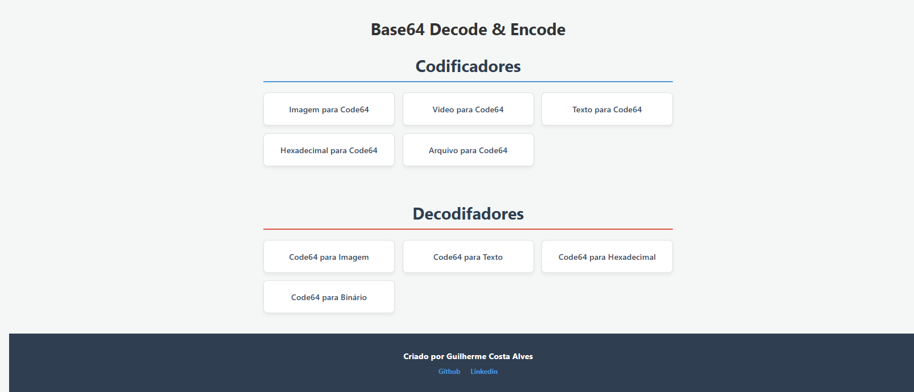

Base64 Decode & Encode 🚀
Um conversor web completo para codificação e decodificação de diversos formatos para Base64 (Code64) e vice-versa. O projeto oferece suporte para imagens, vídeos, textos, arquivos e dados hexadecimais.

📋 Funcionalidades
O projeto está dividido em duas categorias principais:

1. Codificadores (Para Code64)
Imagem para Code64: Converte arquivos de imagem (PNG, JPG, JPEG) em strings Base64.

Vídeo para Code64: Transforma arquivos de vídeo em formato codificado.

Texto para Code64: Codifica strings de texto simples.

Hexadecimal para Code64: Converte valores hexadecimais para Base64.

Arquivo Geral: Codificador genérico para qualquer tipo de arquivo.

2. Decodificadores (De Code64)
Code64 para Imagem: Reconstrói a imagem a partir do código e permite o download.

Code64 para Texto: Decodifica a string para texto legível.

Code64 para Hexadecimal: Converte o código Base64 de volta para valores Hex.

Code64 para Binário: Exibe a representação binária (8 bits) do código.

🛠️ Tecnologias Utilizadas
HTML5: Estrutura semântica das páginas.

CSS3: Design responsivo utilizando CSS Grid e transições suaves.

JavaScript (ES6+): Lógica de conversão utilizando FileReader API, atob(), btoa() e a moderna Clipboard API.
Clone este repositório:

Bash

git clone https://github.com/Wereouts/conversor.git
Abra o arquivo index.html em qualquer navegador moderno.

Nenhuma dependência externa ou servidor é necessário (roda inteiramente no cliente).

💡 Destaques do Código
Cópia com um clique: Implementação da função copiarTexto() que utiliza navigator.clipboard para facilitar a experiência do usuário.

Download Automático: Na decodificação de imagens, o sistema identifica se o arquivo original era JPEG ou PNG para gerar a extensão correta no download.

Responsividade: Layout adaptável para dispositivos móveis através de Media Queries.

👤 Autor
Guilherme Costa Alves
